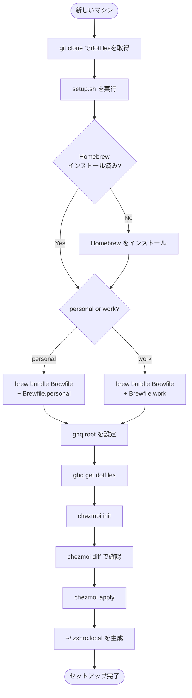

# dotfiles

My personal configuration files, managed with [chezmoi](https://www.chezmoi.io/).

## Managed Files

| ソース | 展開先 |
|---|---|
| `dot_zshrc` | `~/.zshrc` |
| `dot_zprofile` | `~/.zprofile` |
| `dot_gitconfig.tmpl` | `~/.gitconfig`（テンプレート） |
| `dot_config/starship.toml` | `~/.config/starship.toml` |
| `dot_config/ghostty/config` | `~/.config/ghostty/config` |
| `private_dot_ssh/config` | `~/.ssh/config` |
| `Library/Application Support/Code/User/settings.json` | `~/Library/Application Support/Code/User/settings.json` |
| `Library/Application Support/Code/User/keybindings.json` | `~/Library/Application Support/Code/User/keybindings.json` |
| `dot_claude/skills/add-dotfile/SKILL.md` | `~/.claude/skills/add-dotfile/SKILL.md` |
| `dot_claude/skills/update-dotfile/SKILL.md` | `~/.claude/skills/update-dotfile/SKILL.md` |

**除外ファイル（git管理外）:**
- `~/.zshrc.local` — マシン固有設定（PATH、環境変数、エイリアスなど）
- `~/.config/gh/` — GitHub CLI 認証情報

## Setup

### 新しいマシンのセットアップ手順

```sh
# 1. リポジトリを取得（git は macOS に標準搭載）
git clone git@github.com:bobtaroh/dotfiles.git ~/dotfiles-tmp

# 2. セットアップスクリプトを実行
~/dotfiles-tmp/setup.sh
```

`setup.sh` の実行中に以下を対話形式で入力する：

- **personal / work** — マシンの種別
- **ghq root** — ghq のルートディレクトリ（デフォルト: `~/Documents/src`）
- **Git email address** — マシンで使う git のメールアドレス
- **Git name** — git のユーザー名

### セットアップフロー



### 既存マシン（再適用）

```sh
chezmoi apply
```

## Brewfile

| ファイル | 用途 |
|---|---|
| `Brewfile` | 共通ツール（全マシン） |
| `Brewfile.personal` | 個人PC専用 |
| `Brewfile.work` | 会社PC専用（会社固有ツールを追記） |

> 会社でブロックされているツールがある場合は `Brewfile` から外して手動インストールで対応する。

## Zsh Configuration

`.zshrc`（共通設定）と `~/.zshrc.local`（マシン固有設定）の2ファイル構成。

- `.zshrc` の末尾で `~/.zshrc.local` を読み込む
- マシン固有の PATH・環境変数・エイリアスは `.zshrc.local` に記述する

## Editor

chezmoi のエディタは VSCode に設定済み（`.chezmoi.toml.tmpl`）。

```sh
chezmoi edit --apply ~/.zshrc   # VSCode で編集して即反映
```

## VSCode Extensions

インストール済み拡張機能の一覧は `vscode/extensions.txt` で管理。

```sh
cat $(chezmoi source-path)/vscode/extensions.txt | xargs -L 1 code --install-extension
```

## Useful Commands

```sh
chezmoi edit --apply <file>   # ファイルを編集して即反映（展開先パスを指定）
chezmoi diff                  # 未適用の変更内容を確認
chezmoi apply                 # ホームディレクトリに展開
chezmoi status                # 変更差分の状態確認
chezmoi managed               # chezmoi が管理するファイル一覧
chezmoi verify                # 展開済みファイルとソースの整合性チェック
chezmoi cd                    # ソースディレクトリに移動
```
